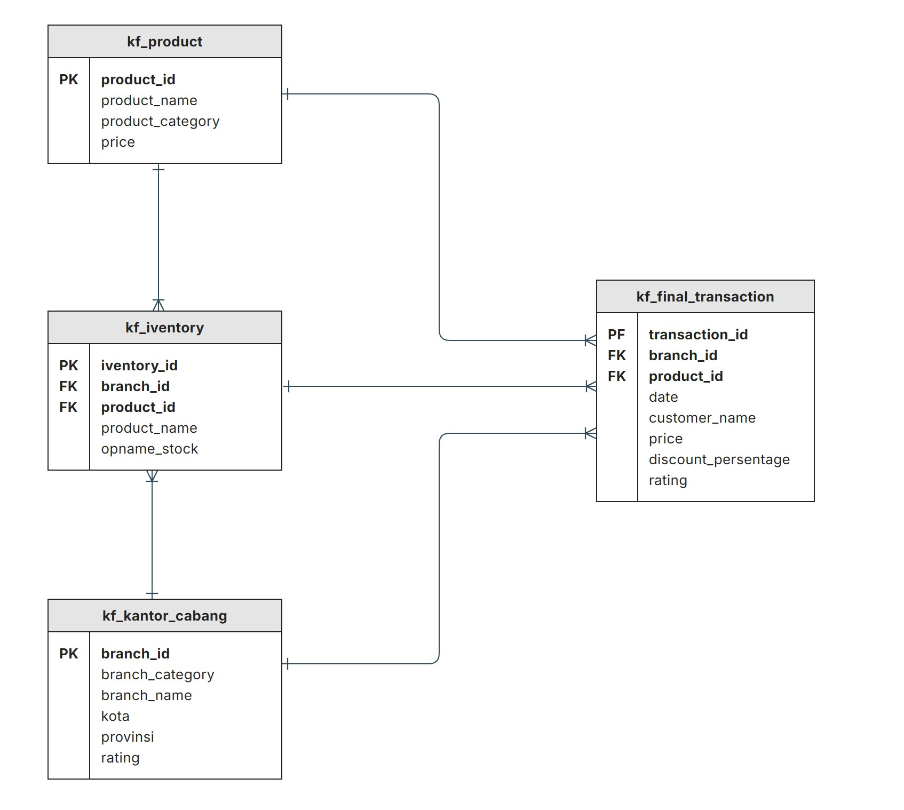

<h1>🧾 Performance Analytics Kimia Farma Bussines Year 2020-2023 - Project Based Internship </h1>

  

    <h2>📌 Background</h2>
    
This project is part of <strong>Project-Based Internship Rakamin x Kimia Farma</strong>. In this project, as a Big Data Analytics intern at Kimia Farma, I was tasked with evaluating the company's business performance from 2020 to 2023 by utilizing transaction data stored in BigQuery and visualizing it through Looker Studio.

  

  <h2>📌 Datasets</h2>
  The datasets include
    <ul>
      <li><code>kf_transaction.csv</code></li>
      <li><code>kf_final_transaction.csv</code></li>
      <li><code>kf_inventory.csv</code></li>
      <li><code>kf_product.csv</code></li>
    </ul>
   

    <h2>🎯 Challenge Tasks</h2>
    <ol>
      <li><strong>Importing Dataset to BigQuery</strong> All four datasets were uploaded and structured using Google BigQuery for centralized querying and integration.</li>
      <li><strong>Build Analytical Table</strong> Create a consolidated table (I named it) <code>kf_analytics</code> that includes all <em>mandatory fields</em>, integrating data from transaction, branch, and product tables based on the ERD schema.</li>
      <li><strong>Create Dashboard: Performance Analytics Kimia Farma Business Year 2020–2023</strong> Use Looker Studio to visualize performance metrics such as sales, profits, transactions, and customer satisfaction ratings by location and branch.</li>
    </ol>
  

   

    <h2>📥ERD </h2>

Before writing the SQL query, I analyzed the relationships among the four provided tables using ERD modeling. The resulting ERD (Entity Relationship Diagram) is as follows:

    
  

  

  

    <h2>📥 Query SQL</h2>
    
The following query was developed as my own work based on the ERD structure and required fields

    <pre>
    
CREATE TABLE kimia_farma.kf_analytics AS
SELECT
  ft.transaction_id,
  ft.date,
  kc.branch_id,
  kc.branch_name,
  kc.kota,
  kc.provinsi,
  kc.rating as rating_cabang,
  ft.customer_name,
  p.product_id,
  p.product_name,
  p.price as actual_price,
  ft.discount_percentage,
  CASE
    WHEN p.price <=50000 THEN 0.10
    WHEN p.price > 50000 AND p.price <= 100000 THEN 0.15
    WHEN p.price > 100000 AND p.price <= 300000 THEN 0.20
    WHEN p.price > 300000 AND p.price <= 500000 THEN 0.25
    ELSE 0.30
  END AS persentase_gross_laba,
  (p.price * (1 - ft.discount_percentage )) AS nett_sales,
  (p.price * (1 - ft.discount_percentage ))* (
        CASE
            WHEN p.price <= 50000 THEN 0.10
            WHEN p.price > 50000 AND p.price <= 100000 THEN 0.15
            WHEN p.price > 100000 AND p.price <= 300000 THEN 0.20
            WHEN p.price > 300000 AND p.price <= 500000 THEN 0.25
            ELSE 0.30
        END
    ) AS nett_profit,
  ft.rating AS rating_transaksi
FROM `rakamin-kf-analytics-463308.kimia_farma.kf_final_transaction` as ft 
LEFT JOIN `rakamin-kf-analytics-463308.kimia_farma.kf_kantor_cabang` as kc 
  ON ft.branch_id = kc.branch_id 
LEFT JOIN `rakamin-kf-analytics-463308.kimia_farma.kf_product` as p 
  ON ft.product_id = p.product_id
    </pre>
  

  

    <h2>🧮 Output Tabel Analisa</h2>
    

     
Dataset memiliki 16 kolom yang memuat data transaksi Kimia Farma dari 2020–2023:

    <ul>
      <li><code>transaction_id</code>, <code>date</code>, <code>branch_id</code>, <code>branch_name</code></li>
      <li><code>kota</code>, <code>provinsi</code>, <code>rating_cabang</code>, <code>customer_name</code></li>
      <li><code>product_id</code>, <code>product_name</code>, <code>actual_price</code>, <code>discount_percentage</code></li>
      <li><code>persentase_gross_laba</code> (berdasarkan harga)</li>
      <li><code>nett_sales</code>, <code>nett_profit</code>, <code>rating_transaksi</code></li>
    </ul>

   
  

   

    <h2>📊 Dashboard Overview – Performance Analytics Kimia Farma 2020–2023</h2>
 
After validating the analytical table, proceed with building an interactive dashboard in Looker Studio with dynamic filters (year, province, product category).

   
<strong>Dashboard Requirements:</strong>

    
The dashboard is required to include the following components:

    <ul>
      <li><strong>Dashboard Title</strong></li>
      <li><strong>Summary Section</strong> (Total Sales, Profit, Transactions, Ratings)</li>
      <li><strong>Filter Controls</strong> (Year, Province, Branch Category, Product Category)</li>
      <li><strong>Snapshot of Key Metrics</strong></li>
    </ul>

   
<strong>Core Visualizations That Must Be Included:</strong>

    <ul>
      <li>Comparison of Kimia Farma Profit (Year-over-Year)</li>
      <li>Top 10 Branches by Total Transactions (by Province)</li>
      <li>Top 10 Branches by Nett Sales (by Province)</li>
      <li>Top 5 Branches with Highest Branch Rating but Low Transaction Rating</li>
      <li>Geo Map of Indonesia showing Total Profit per Province</li>
      <li>Additional insights that can be explored independently</li>
    </ul>

   
As part of the additional insights, I contributed the following custom charts:

    <ul>
      <li><strong>Year-over-Year (YoY) Profit Growth Table</strong></li>
      <li><strong>Bar Chart: Product Sales and Profit</strong></li>
       <li><strong>Performance Highlights </strong></li>
    </ul>
    
These charts enhance the dashboard’s ability to communicate trends and profitability over time as well as highlight product-level performance.

    
To better understand the structure, you can refer to the dashboard bellow.

    

</body>
</html>
   